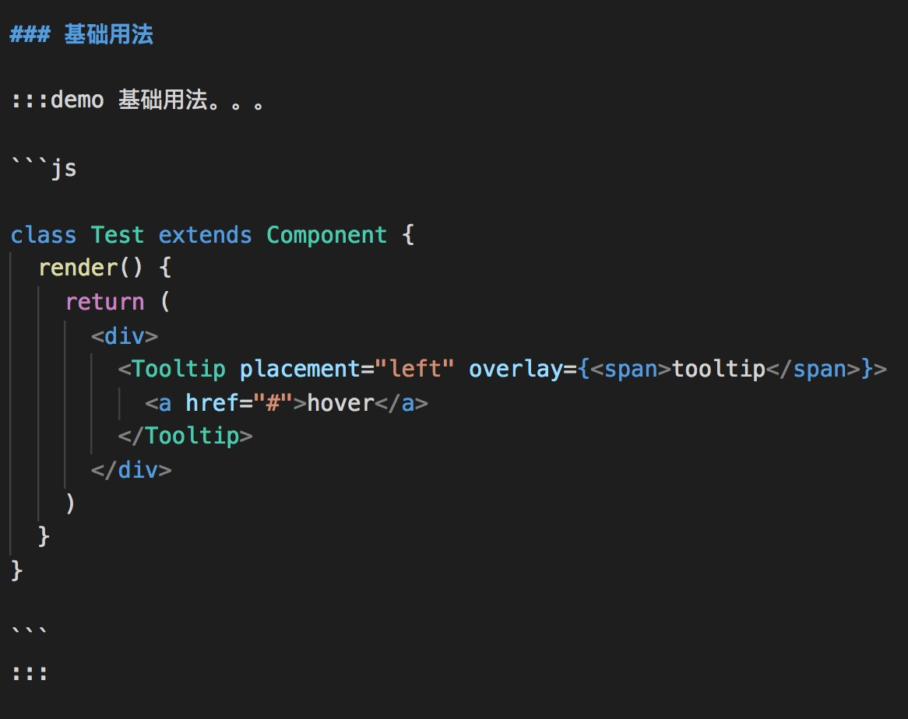
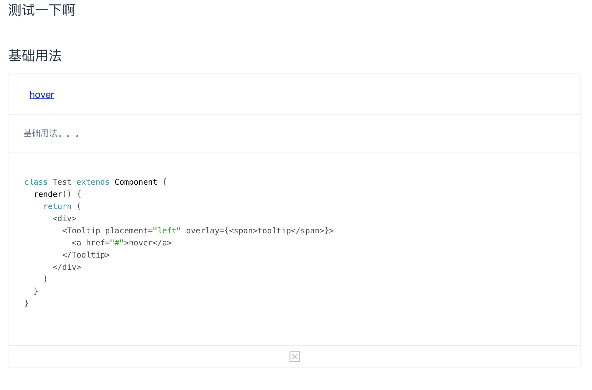

## doc-react
react 组件文档：通过markdown语法渲染出组件，快速方便为你的组件写出优美的文档。

## 如何使用
下载：

```
npm install raw-loader -dev
```

```
npm install doc-react --save
```

在你webpack的loader添加一行规则：

```
{
  test: /\.md$/,
  loader : 'raw-loader'
}
```

代码引入

```
import Tooltip from 'rc-tooltip'
import docReact from 'doc-react'
import toolipMd from '../doc/tooltip.md'

const Doc = docReact({ Tooltip }, toolipMd)

const Home = () => <div><Doc /></div>;
```

tooltip.md 部分代码



渲染出



详细demo：[https://github.com/canfoo/doc-react/blob/master/example/app.js](https://github.com/canfoo/doc-react/blob/master/example/app.js)
